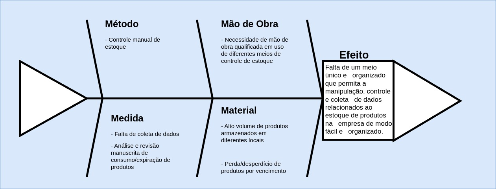

# VISÃO DE PRODUTO E PROJETO

## 1. VISÃO GERAL DO PRODUTO
### 1.1 Problema
O problema se constitui, na organização de um depósito central de nove unidades da rede de Ensino Biângulo, cuja gestão implica o controle rigoroso da entrada e saída de suprimentos e produtos. É crucial a emissão de etiquetas com códigos de barras individuais para cada item recebido, viabilizando sua identificação, bem como o acompanhamento minucioso das quantidades armazenadas. Além disso, é fundamental a geração de dados estatísticos para uma gestão mais eficaz. Destaca-se que os produtos podem ser distribuídos para todas as unidades conforme suas respectivas necessidades e os pedidos realizados. 

Figura 1 - Diagrama de Ishikawa (fonte: autores, 2024)

### 1.2 Declaração de Posição do Produto

| Para | Rede Colégio Biângulo |
| ---- | --------------------- |
| Quem | Necessita de gerir eficientemente o depósito das várias unidades do colégio |
| O SCESPE | É um sistema eficiente de controle de estoque |
| Que | Auxílio na gestão de depósito, de forma eficiente e organizada, integrando o estoque das unidades para uma análise geral e específica |
| Ao contrário | Planilhas digitais, manuscrita ou afins |
| Nosso produto | Ofertará estoque controlado e eficiente |

### 1.3 Objetivos do Produto

Tem-se por objetivo desenvolver um software eficiente e intuitivo para a gestão de estoque em um depósito central de uma rede de escolas com nove unidades, permitindo o controle detalhado dos suprimentos, movimentação de itens entre unidades, geração de relatórios e integração com sistemas de compra e fornecedores.

### 1.4 Tecnologias a Serem Utilizadas

## 2. VISÃO GERAL DO PROJETO
### 2.1 Organização do projeto

| Papel | Atribuições | Responsável | Participantes |
| ----- | ----------- | ----------- | ------------- |
| Desenvolvedor |  Codificar o produto, codificar testes unitários, realizar refatoração | Maria | José, João, Laura, Sandra |
| Dono do produto |
| Analista de Qualidade |
| Cliente |

### 2.2 Planejamento das Fases e/ou Iterações do Projeto

| Sprint | Produto (Entrega) | Data Início | Data Fim |
| ------ | ----------------- | ----------- | -------- |
| Sprint 1 |
| ... |

### 2.3 Matriz de comunicação

| Descrição | Área/Envolvidos | Periodicidade | Produtos Gerados |
| --------- | --------------- | ------------- | ---------------- |
| ... |

### 2.4 Gerenciamento de Riscos

### 2.5 Critérios de Replanejamento

## 3. PROCESSO DE DESENVOLVIMENTO DE SOFTWARE
### 3.1 Metodologia

## 6. Histórico de Revisão
| Data | Versão | Descrição | Autor |
| ---- | ------ | --------- | ----- |
| 02/04/2024 | `0.1` | Criação do documento | Henrique Quenino, Vinicius Santos, André Silva, Bruno de Menezes, Eduardo Sandes, Larissa Vieira, Carlos Eduardo Alves |
| 04/04/2024 | `0.2` | Evolução do documento | Henrique Quenino, Vinicius Santos, André Silva, Bruno de Menezes, Eduardo Sandes, Larissa Vieira, Carlos Eduardo Alves |
| 08/04/2024 | `1.0` | Visão Geral do Produto | Henrique Quenino, Vinicius Santos, André Silva, Bruno de Menezes, Eduardo Sandes, Larissa Vieira, Carlos Eduardo Alves |
| 15/04/2024 | `1.1` | Criação do documento no gitpages | Henrique Quenino, Vinicius Santos, André Silva, Bruno de Menezes, Eduardo Sandes, Larissa Vieira, Carlos Eduardo Alves |